# Resource Detail Panels — Mermaid Visual Spec (2026-07-07)

> **Purpose**: Visual layout spec for the 5 resource detail panels (per audit §23).
> Rendered entirely in **Mermaid** (per `lessons.md` convention).
>
> **Detail panel pattern precedent**: `08-users.svg` opens a right-side detail panel for selected user. Same pattern extended to VMs/Containers/Jails/Volumes/Nodes.

---

## 0. Layout pattern (consistent across all 5 detail panels)

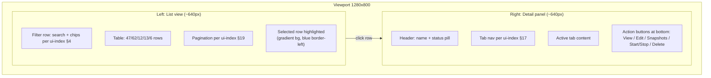

---

## 1. VM Detail Panel (`19-vm-detail-panel.svg` + `20-vm-detail-overview.svg`)

### Structure

```mermaid
flowchart TB
  subgraph Header["Header: VM name + status pill"]
    H1["nextcloud"]
    H2["● RUN<br/>badge bg #d1fae5, color #065f46"]
    H3[VM id: ulid-xxx]
  end
  subgraph TabNav["Tab nav (7 tabs per ui-index §17 example)"]
    direction LR
    T1["Overview<br/><b>ACTIVE</b>"]
    T2[Disks]
    T3[Network]
    T4[Snapshots]
    T5[Console]
    T6[Logs]
    T7[Settings]
  end
  subgraph OverviewContent["Overview tab (active)"]
    O1[Section: Identity]
    O2["id: ulid-xxx<br/>name: nextcloud<br/>description: Personal cloud"]
    O3[Section: Configuration]
    O4["type: bhyve<br/>OS: Debian 12<br/>generation: 2"]
    O5[Section: Resources]
    O6["vCPU: 4 cores<br/>RAM: 8 GB<br/>Disk: 80 GB<br/>(per data-structures.md interface VM)"]
    O7[Section: Network]
    O8["IPv4: 10.0.10.10<br/>IPv6: fd00::10 (dual-stack per 16-ips-modal.svg)"]
    O9[Section: Schedule / State]
    O10["uptime: 14d 02:11<br/>created: 2026-05-20<br/>next backup: 02:00 UTC"]
  end
  subgraph ActionBar["Action bar (bottom)"]
    A1["View (primary blue)"] ~~~ A2[Edit] ~~~ A3[Snapshot] ~~~ A4[Start/Stop] ~~~ A5[Delete (red, type-to-confirm)]
  end
```

### VM tabs (7 per ui-index §17 example)

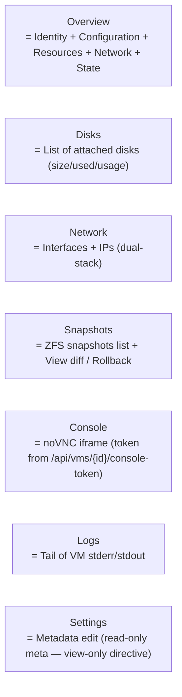

### Data source

```mermaid
erDiagram
  VMDetailPanel {
    string vmId FK
    string name
    string status "RUN|STOP|PAUSE|ERROR"
    string description
    string os
    int vcpu
    string ram "Quantity unit GB"
    string disk "Quantity unit GB"
    int uptimeSec
    ipv4 ipv4Addr
    ipv6 ipv6Addr
  }
  VMDisk {
    string diskId FK
    string size "Quantity"
    string used "Quantity"
    float usagePercent
    string mountpoint
  }
  VMNetwork {
    string ifaceId FK
    ipv4 ipv4Addr
    ipv6 ipv6Addr
    string vlan
    string mac
  }
  VMSnapshot {
    string snapId FK
    int epochMs
    string size
    string parent "snapshot chain"]
  }
  VMDetailPanel ||--o{ VMDisk : has
  VMDetailPanel ||--o{ VMNetwork : has
  VMDetailPanel ||--o{ VMSnapshot : has
```

### API endpoints

| Endpoint | MIME type |
|---|---|
| `GET /api/vms/{id}` | `application/vnd.cloudbsd+vm+json` |
| `GET /api/vms/{id}/disks` | `application/vnd.cloudbsd+vm-disk+list` |
| `GET /api/vms/{id}/network` | `application/vnd.cloudbsd+vm-network+list` |
| `GET /api/vms/{id}/snapshots` | `application/vnd.cloudbsd+vm-snapshot+list` |
| `GET /api/vms/{id}/logs` | `application/vnd.cloudbsd+vm-log+list` |
| `GET /api/vms/{id}/console-token` | `application/vnd.cloudbsd+vm-console-token+json` (already §2.20) |

View-only directive: NO write endpoints (POST/PUT/DELETE) for VMs per audit §21.5.

---

## 2. Container Detail Panel (`20-container-detail-panel.svg`)

### Structure

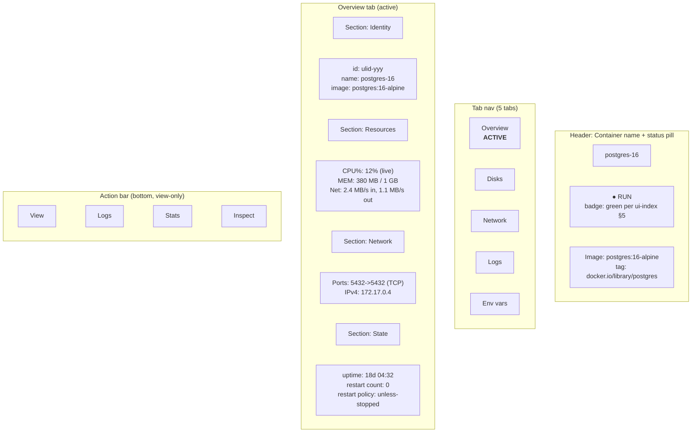

### Container tabs

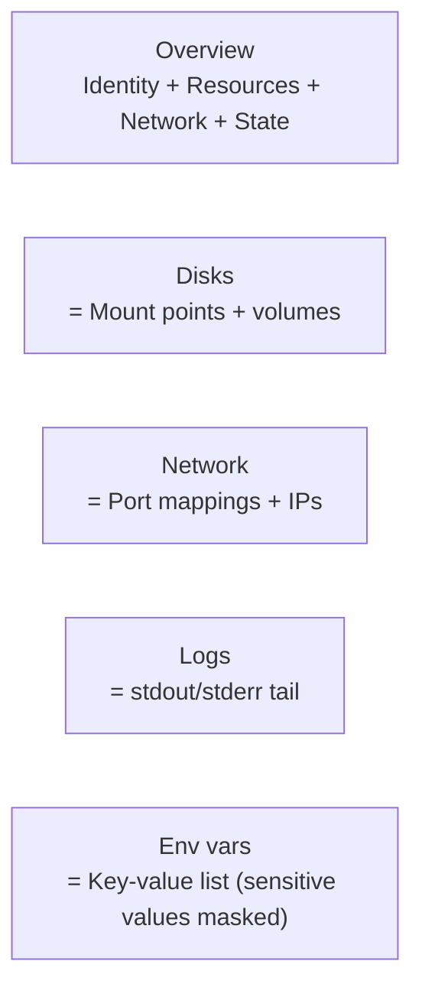

### API endpoints

| Endpoint | MIME type |
|---|---|
| `GET /api/containers/{id}` | `application/vnd.cloudbsd+container+json` |
| `GET /api/containers/{id}/disks` | `application/vnd.cloudbsd+container-disk+list` |
| `GET /api/containers/{id}/network` | `application/vnd.cloudbsd+container-network+list` |
| `GET /api/containers/{id}/logs` | `application/vnd.cloudbsd+container-log+list` |
| `GET /api/containers/{id}/env` | `application/vnd.cloudbsd+container-env+list` |

---

## 3. Jail Detail Panel (`21-jail-detail-panel.svg`)

### Structure

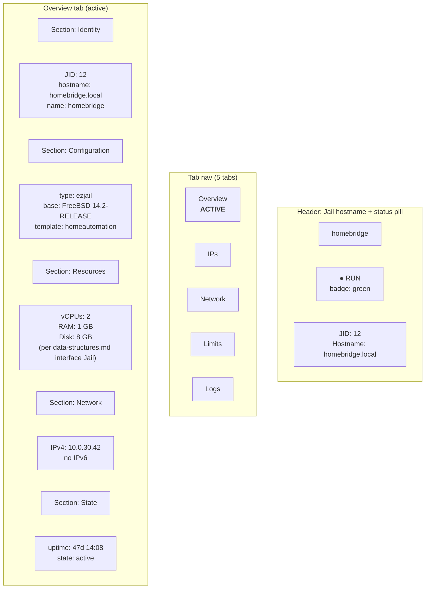

### Jail tabs

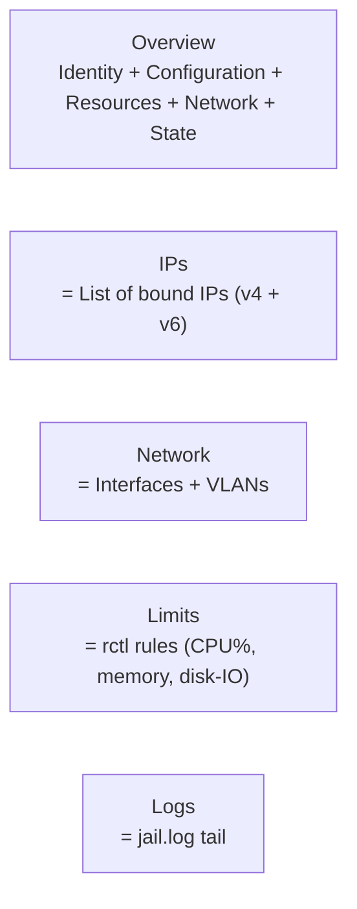

### API endpoints

| Endpoint | MIME type |
|---|---|
| `GET /api/jails/{id}` | `application/vnd.cloudbsd+jail+json` |
| `GET /api/jails/{id}/ips` | `application/vnd.cloudbsd+jail-ip+list` |
| `GET /api/jails/{id}/network` | `application/vnd.cloudbsd+jail-network+list` |
| `GET /api/jails/{id}/limits` | `application/vnd.cloudbsd+jail-limit+list` |
| `GET /api/jails/{id}/logs` | `application/vnd.cloudbsd+jail-log+list` |

---

## 4. Volume Detail Panel (`22-volume-detail-panel.svg`)

### Structure

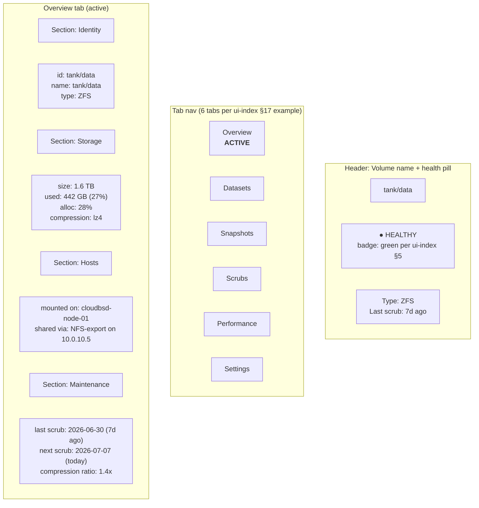

### Volume tabs (6 per ui-index §17 Volume example)

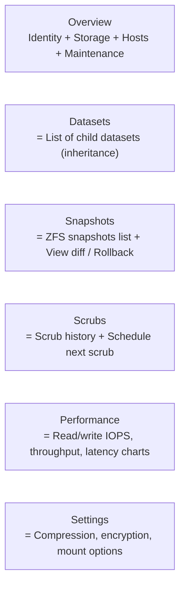

### API endpoints

| Endpoint | MIME type |
|---|---|
| `GET /api/volumes/{id}` | `application/vnd.cloudbsd+volume+json` |
| `GET /api/volumes/{id}/datasets` | `application/vnd.cloudbsd+volume-dataset+list` |
| `GET /api/volumes/{id}/snapshots` | `application/vnd.cloudbsd+volume-snapshot+list` |
| `GET /api/volumes/{id}/scrubs` | `application/vnd.cloudbsd+volume-scrub+list` |
| `GET /api/volumes/{id}/performance` | `application/vnd.cloudbsd+volume-performance+json` |

View-only: NO write endpoints for volumes per audit §21.5 (mutations route through TaskSchedule).

---

## 5. Node Detail Panel (`23-node-detail-panel.svg`)

### Structure

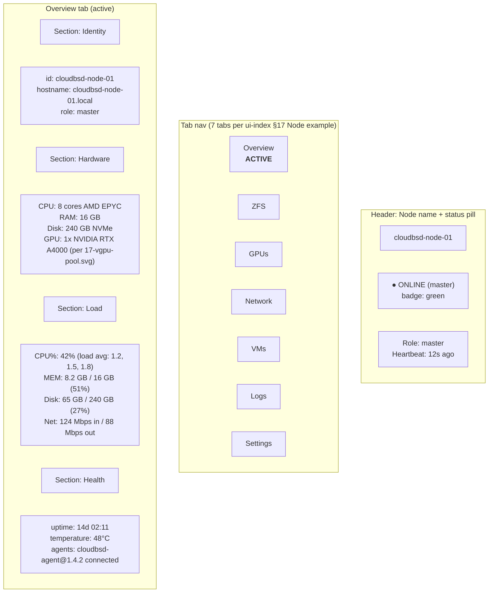

### Node tabs (7 per ui-index §17 Node example)

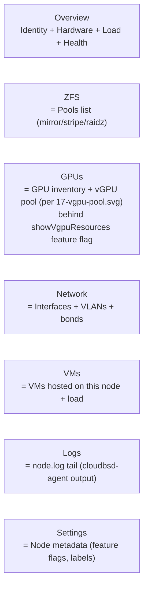

### API endpoints

| Endpoint | MIME type |
|---|---|
| `GET /api/nodes/{id}` | `application/vnd.cloudbsd+node+json` |
| `GET /api/nodes/{id}/zfs` | `application/vnd.cloudbsd+node-zfs+list` |
| `GET /api/nodes/{id}/gpus` | `application/vnd.cloudbsd+node-gpu+list` (per 17-vgpu-pool.svg) |
| `GET /api/nodes/{id}/network` | `application/vnd.cloudbsd+node-network+list` |
| `GET /api/nodes/{id}/vms` | `application/vnd.cloudbsd+node-vm+list` |
| `GET /api/nodes/{id}/logs` | `application/vnd.cloudbsd+node-log+list` |

---

## 6. Cross-detail-panel invariants

All 5 detail panel SVGs share:

```mermaid
flowchart TB
  subgraph Shared["Shared across all 5 detail panels"]
    direction TB
    S1["List on left (~640px)<br/>filter row + table + pagination"]
    S2["Detail on right (~640px)<br/>header + tab nav + content + action bar"]
    S3["Header structure: name + status pill (ui-index §5) + id/ulid"]
    S4["Tabs per ui-index §17 resource examples<br/>VM=7, Container=5, Jail=5, Volume=6, Node=7"]
    S5["Action bar per ui-index §6: View→Edit→Snapshot→Start/Stop→Delete"]
    S6["Inline styles ONLY (no class=, no Tailwind) per lessons.md"]
    S7["Viewport 1280x800 per diagrams/README.md"]
    S8["Color palette per ui-index §20"]
    S9["View-only: NO write endpoints except via TaskSchedule (per audit §21.5)"]
  end
```

### Action bar spec (ui-index §6)

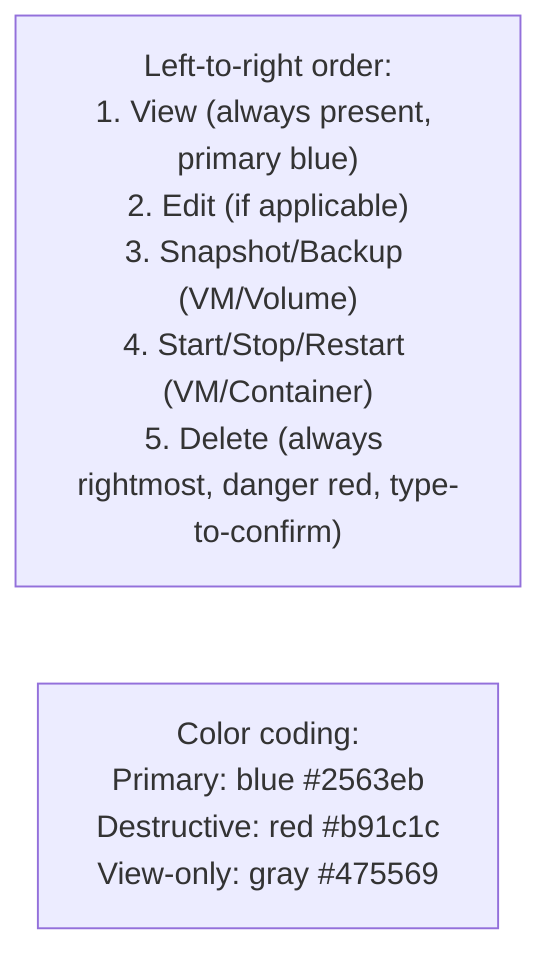

---

## 7. Executor conversion steps

The executor renders each detail panel into a 1280×800 SVG per the Mermaid spec:

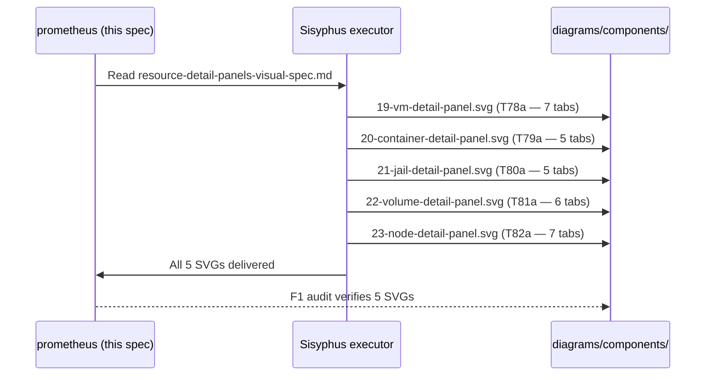

Per SVG:
1. Layout: list view (~640px left) + detail panel (~640px right)
2. Use Mermaid `flowchart TB` above as structural blueprint
3. Replace nodes with `<div style="position:absolute;...">` per lessons.md
4. Status pills per ui-index §5 (Running/Healthy/Online/etc.)
5. Tabs per ui-index §17 examples
6. Inline-styles-only — no `class=`, no Tailwind
7. Verify `grep -r 'class="' diagrams/components/{19,20,21,22,23}-*.svg` returns 0

---

## 8. Cross-reference table

| This spec | Plan task | Audit section |
|---|---|---|
| VM detail | T78 | audit §23 (click affordances) |
| Container detail | T79 | audit §23 |
| Jail detail | T80 | audit §23 |
| Volume detail | T81 | audit §23 |
| Node detail | T82 | audit §23 |

---

## 9. Sign-off

This document is the **Mermaid-based visual spec** for the 5 resource detail panels.

User can preview in any markdown viewer to verify visual coverage before SVG generation.

Date: 2026-07-07
Author: prometheus (planner)
Status: MERMAID VISUAL SPEC COMPLETE — executor converts to SVG per Wave 10 T78a-T82a.
