# System Management — Per-Tab Visual Spec (2026-07-07)

> **Purpose**: Visual layout spec for the 6 System Management tabs (per ui-index §17).
> Rendered entirely in **Mermaid** (per `lessons.md` convention: Mermaid for diagrams, NOT UI mockups via SVG).
>
> **Note**: Mermaid `flowchart` is the layout tool here — yes, this spec is a diagram, not
> a 1280×800 mockup. The executor converts these Mermaid diagrams into actual
> `diagrams/screens/16-system-{N}-*.svg` files using the structural + content data below.
>
> **Constraint note**: The planner (prometheus) is markdown-only — SVGs cannot be written
> directly. This document is the source-of-truth spec; the executor produces the SVGs.
>
> **IA update 2026-07-16**: Nav label is **System** under Operate (not "System Mgmt" in Admin
> alone). Tabs should evolve toward: Backups (policies+runs), Exports, Diagnostics (absorb
> Status), Audit, Updates, Maintenance. Stats tiles that count themes/locales are non-operational
> — prefer capacity/ops metrics. Sidebar item list in § diagrams below is **historical**; use
> `ui-index.md` §8 + `docs/migration/product-ia-esxi-vsphere-2026-07-16.md` §3–4 for nav.

---

## 0. Tab nav (consistent across all 6 tab SVGs)

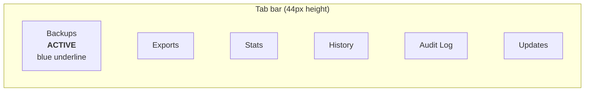

**One tab styled ACTIVE per SVG** (left-to-right: Backups → Exports → Stats → History → Audit Log → Updates, per ui-index §17). Active style: `color:#1d4ed8; background:#ffffff; border-bottom:2px solid #2563eb`. Inactive: `color:#64748b; border-bottom:2px solid transparent`.

---

## 1. TAB 1: Backups (`16-system-1-backups.svg`)

### Page structure

```mermaid
flowchart TB
  subgraph Header["Header (56px)"]
    H1[Logo "C"] ~~~ H2[CloudBSD Admin] ~~~ H3[cloudbsd-node-01.local] ~~~ H4[TZ selector] ~~~ H5[Bell+17] ~~~ H6[Avatar M]
  end

  subgraph Sidebar["Sidebar (224px)"]
    subgraph Overview["Overview"]
      O1[Dashboard] ~~~ O2[VMs] ~~~ O3[Containers] ~~~ O4[Jails] ~~~ O5[Volumes] ~~~ O6[Network Map] ~~~ O7[Cluster] ~~~ O8[Nodes]
    end
    subgraph Admin["Admin"]
      A1[Users] ~~~ A2[Logs] ~~~ A3[Notifications] ~~~ A4[Settings] ~~~ A5[System Mgmt] ~~~ A6[Status] ~~~ A7[About]
    end
  end

  subgraph Main["Main content"]
    P1[Page header: System Management + Admin-only badge]
    subgraph TabNav["Tab nav — Backups ACTIVE"]
      TA[Backups ACTIVE] ~~~ TB[Exports] ~~~ TC[Stats] ~~~ TD[History] ~~~ TE[Audit Log] ~~~ TF[Updates]
    end
    subgraph Panel["Scheduled Backups panel"]
      PH[Heading: 'Scheduled Backups'] ~~~ PB[+ New schedule primary button]
      subgraph Table["Table (8 cols)"]
        direction LR
        C1[Name] ~~~ C2[Schedule] ~~~ C3[Last run] ~~~ C4[Size] ~~~ C5[Status] ~~~ C6[Retention] ~~~ C7[Destination] ~~~ C8[Actions]
      end
      subgraph Rows["5 sample rows"]
        R1["daily-tank-data · Daily 02:00 · 3.2 GB · healthy · 14d · node-02 · Run/Delete"]
        R2["weekly-full-cluster · Weekly Sun 03:00 · 24 GB · healthy · 90d · rsync.net · Run/Delete"]
        R3["hourly-incremental · Hourly :15 · 120 MB · healthy · 48h · ZFS snap · Run/Delete"]
        R4["monthly-archive · Monthly 1st 04:00 · 180 GB · healthy · 5y · encrypted · Run/Delete"]
        R5["failed-jellyfin-vm · Daily 01:00 · — · failed · — · disk full · Run/Delete"]
      end
    end
  end
```

### Interaction state diagram

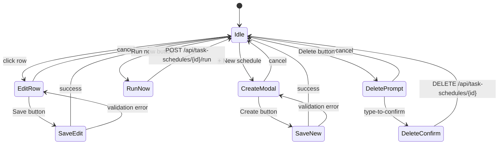

### 5 sample backup rows (table data)

| # | Name | Schedule | Last run | Size | Status | Retention | Destination |
|---|------|----------|----------|------|--------|-----------|-------------|
| 1 | daily-tank-data | Daily 02:00 UTC | 12:42:18Z | 3.2 GB | healthy (green) | 14d retention | replicated to node-02 |
| 2 | weekly-full-cluster | Weekly Sun 03:00 | 04:00:00Z Sun | 24 GB | healthy | 90d retention | offsite: rsync.net |
| 3 | hourly-incremental | Hourly :15 | 09:14:00Z | 120 MB | healthy | 48h retention | ZFS snapshots |
| 4 | monthly-archive | Monthly 1st 04:00 | 04:00:00Z 1st | 180 GB | healthy | 5y retention | encrypted + offsite |
| 5 | failed-jellyfin-vm | Daily 01:00 | last error | — | failed (red) | — | last error: disk full |

Row actions: `Run now` (border gray) + `Delete` (border red `#fecaca`).

---

## 2. TAB 2: Exports (`16-system-2-exports.svg`)

### Page structure

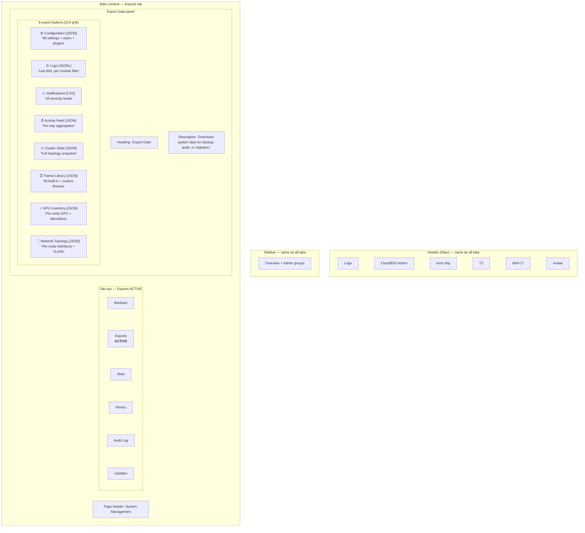

### 8 export button definitions

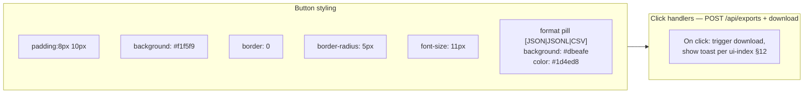

Each button is `display:flex; align-items:center; gap:6px;` with icon (left, 14px), label (middle, flex:1), format pill (right, 9px).

### Export → MIME type mapping (per `mime-registry.md`)

| Export | Wire-protocol path | MIME type |
|---|---|---|
| Configuration | `POST /api/exports/config` | `application/vnd.cloudbsd+config-bundle` |
| Logs | `POST /api/exports/logs` | `application/vnd.cloudbsd+logs-bundle+jsonl` |
| Notifications | `POST /api/exports/notifications` | `application/vnd.cloudbsd+notifications-export+csv` |
| Activity Feed | `POST /api/exports/activity` | `application/vnd.cloudbsd+activity-export+json` |
| Cluster State | `POST /api/exports/cluster` | `application/vnd.cloudbsd+cluster-state+json` |
| Theme Library | `POST /api/exports/themes` | `application/vnd.cloudbsd+theme-library+json` |
| GPU Inventory | `POST /api/exports/gpus` | `application/vnd.cloudbsd+gpu-inventory+json` |
| Network Topology | `POST /api/exports/network` | `application/vnd.cloudbsd+network-topology+json` |

---

## 3. TAB 3: Stats (`16-system-3-stats.svg`)

### Page structure

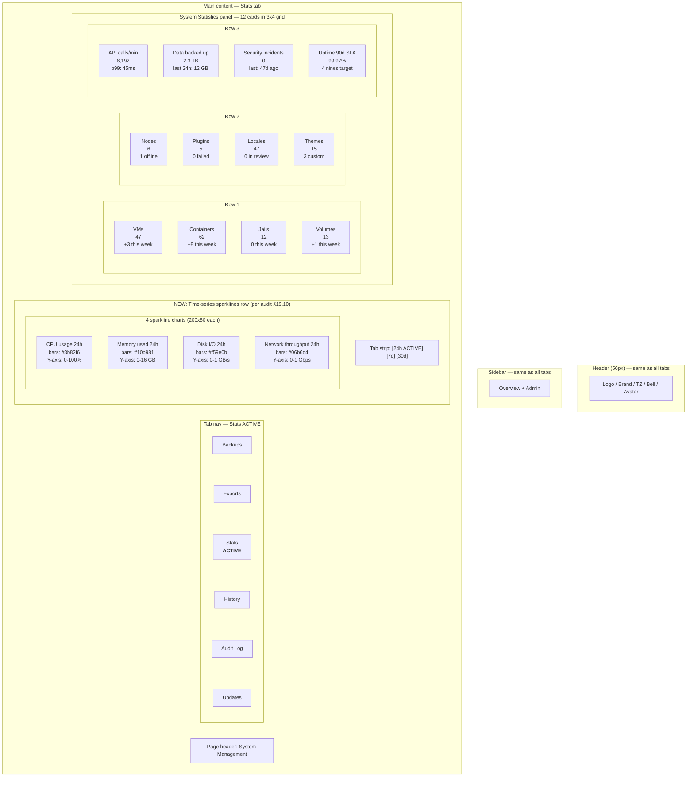

### Card data structure (12 stats)

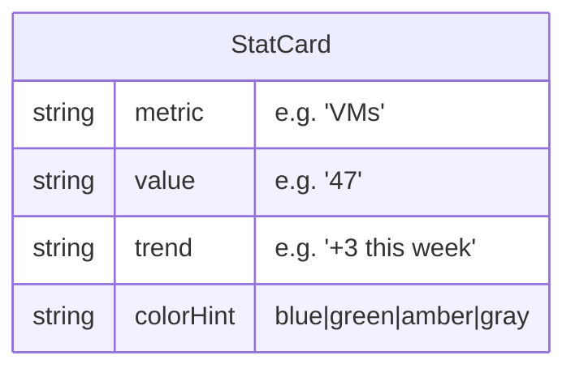

Card style: `background:#f8fafc; border-radius:6px; padding:10px;` with value (18px bold), label (10px caps), trend (10px muted).

### Time-series interaction

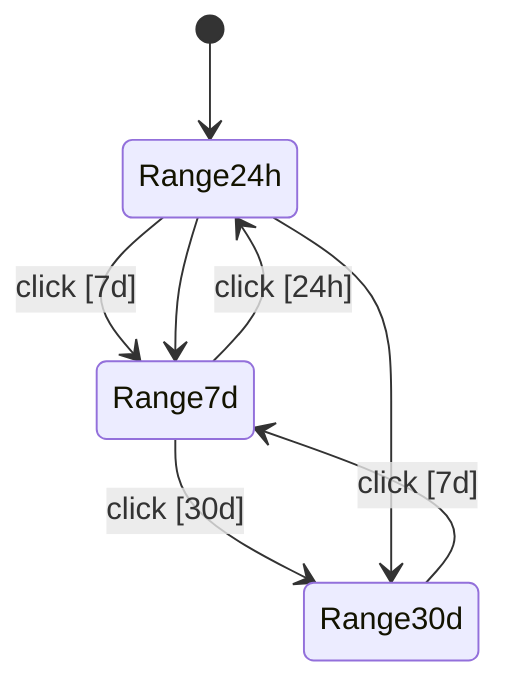

Each range bucket shows 24/168/720 hourly bars respectively.

---

## 4. TAB 4: History (`16-system-4-history.svg`)

### Page structure

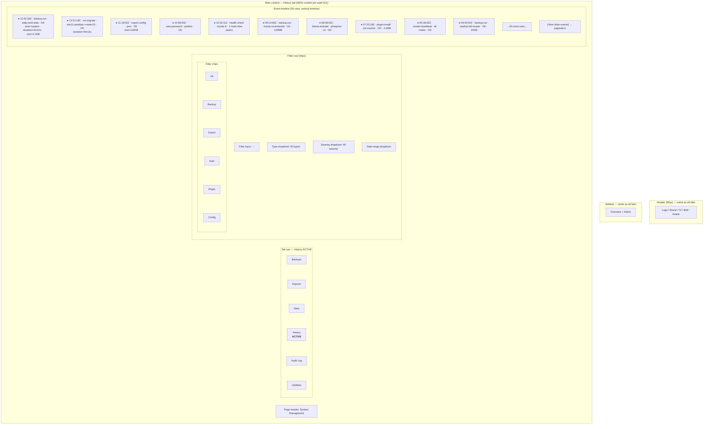

### Filter + row interaction

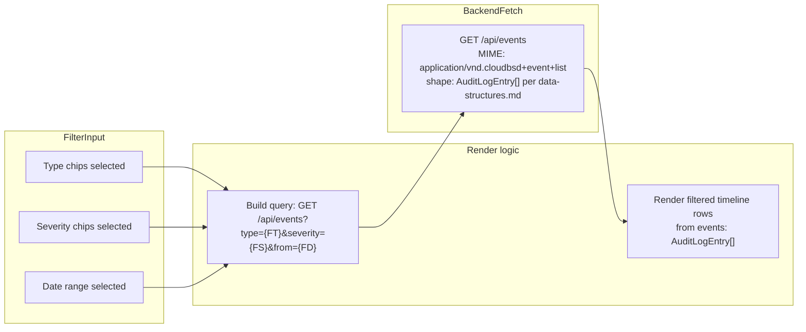

### Event severity legend

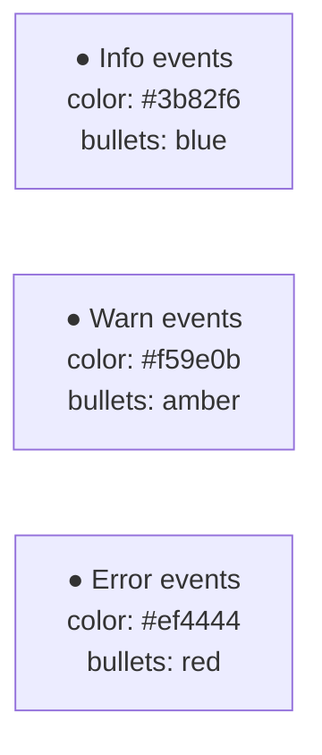

---

## 5. TAB 5: Audit Log (`16-system-5-audit-log.svg`)

### Page structure (renamed from "Recent Admin Actions" per audit §19.10)

```mermaid
flowchart TB
  subgraph Header["Header (56px) — same as all tabs"]
    H[Logo / Brand / TZ / Bell / Avatar]
  end
  subgraph Sidebar["Sidebar — same as all tabs"]
    S[Overview + Admin]
  end
  subgraph Main["Main content — Audit Log tab"]
    P1[Page header: System Management]
    subgraph TabNav["Tab nav — Audit Log ACTIVE"]
      TA[Backups] ~~~ TB[Exports] ~~~ TC[Stats] ~~~ TD[History] ~~~ TE["Audit Log<br/><b>ACTIVE</b>"] ~~~ TF[Updates]
    end
    subgraph Panel["Audit Log panel"]
      PH[Heading: 'Audit Log' (was 'Recent Admin Actions')]
      DD[Filter dropdown: All actions / Backups / Exports / Settings / Users]
      subgraph Table["Table (5 cols)"]
        direction LR
        C1[Time UTC] ~~~ C2[User] ~~~ C3[Action] ~~~ C4[Target] ~~~ C5[Result]
      end
      subgraph Rows["10 rows from existing 16-system.svg"]
        R1["12:42:18Z mlapointe backup.run daily-tank-data OK 3.2GB"]
        R2["12:31:18Z system vm.migrate win11-sandbox→node-02 OK 8m12s"]
        R3["11:18:02Z mlapointe export.config json OK 124KB"]
        R4["10:48:33Z mlapointe user.password jenkins OK"]
        R5["10:32:11Z system health.check cluster:6 1 node slow"]
        R6["09:14:00Z system backup.run hourly-incremental OK 120MB"]
        R7["08:48:02Z mlapointe theme.activate phosphor-crt OK"]
        R8["07:32:18Z mlapointe plugin.install zfs-monitor OK 4.2MB"]
        R9["06:18:00Z system cluster.heartbeat all nodes OK"]
        R10["04:00:00Z system backup.run weekly-full-cluster OK 24GB"]
      end
    end
  end
```

### Note on rename

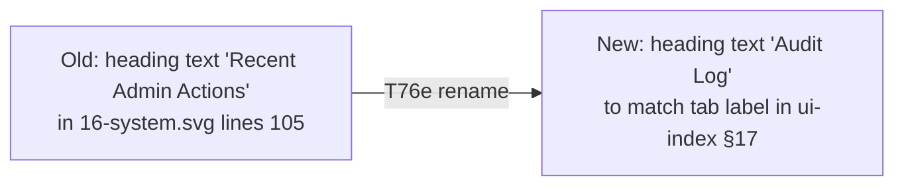

---

## 6. TAB 6: Updates (`16-system-6-updates.svg`)

### Page structure (NEW content — no current spec)

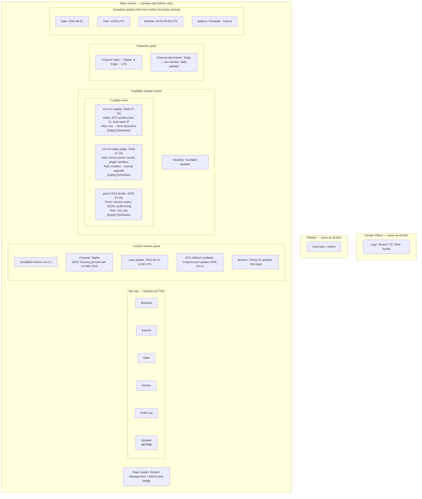

### Update flow state diagram

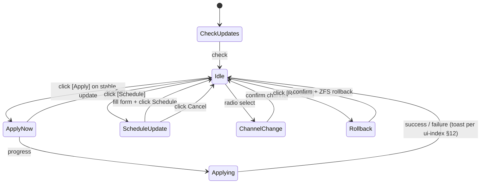

### Forbidden-patterns compliance (per ui-index §16)

```mermaid
flowchart TD
  Start[Version display]
  Start --> Q1{Show git commit hash?}
  Q1 -->|YES| V1[VIOLATES ui-index §16<br/>'Git commit hash in About (closed-source)']
  Q1 -->|NO| Q2{Show backend version in dashboard?}
  Q2 -->|YES| V2[VIOLATES ui-index §16<br/>'Backend version in dashboard (only in /about)']
  Q2 -->|NO| OK[OK: show only<br/>semver (v14.2.1) + channel + last-update time]
```

### Update → MIME type mapping

| Endpoint | MIME type |
|---|---|
| `GET /api/updates/current` | `application/vnd.cloudbsd+current-version+json` |
| `GET /api/updates/available` | `application/vnd.cloudbsd+available-updates+json` |
| `POST /api/updates/apply` | request: `application/vnd.cloudbsd+update-apply+json` |
| `POST /api/updates/schedule` | request: `application/vnd.cloudbsd+update-schedule+json` |
| `POST /api/updates/rollback` | request: `application/vnd.cloudbsd+update-rollback+json` |

---

## 7. Landing page (`16-system.svg` after T76)

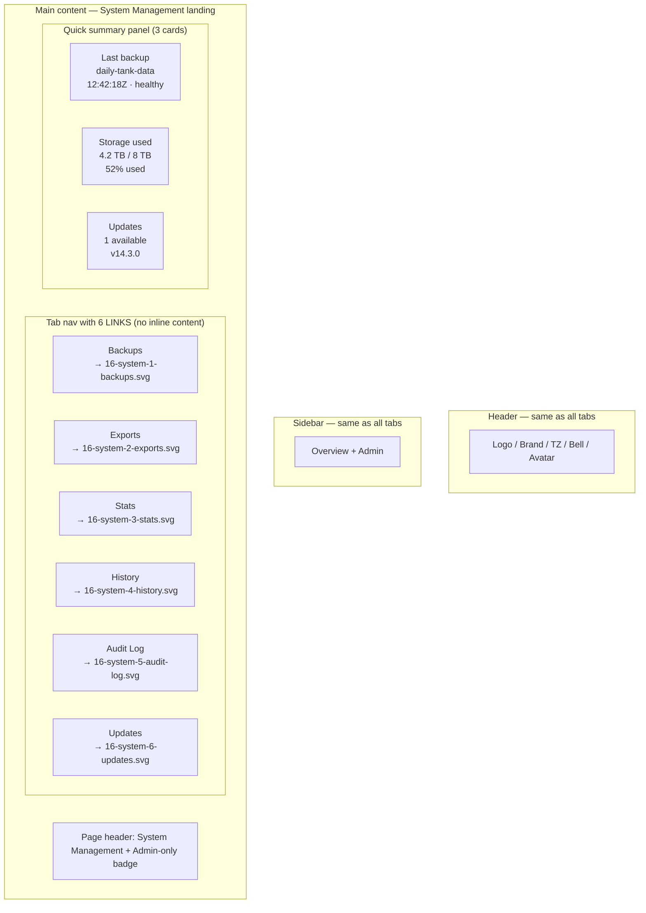

Click any tab → routes to corresponding tab SVG. Landing page is the new minimal `16-system.svg`.

---

## 8. Cross-tab invariants

All 6 tab SVGs share these elements (per `diagrams/README.md` + ui-index §20):

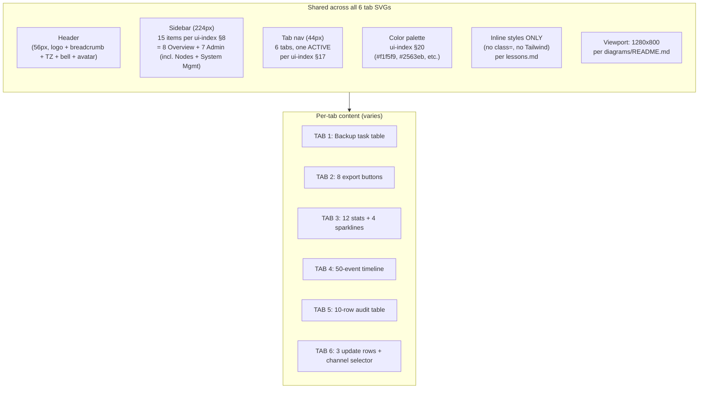

### Visual constant references (sampling from existing files)

| Element | Source location | Color/style |
|---|---|---|
| Sidebar item layout | `02-vms.svg` lines 21-38 (15 items per T74) | padding 7px 12px, border-radius 6px |
| Active sidebar highlight | `02-vms.svg` line 36 (`System Mgmt`) | bg linear-gradient `#eff6ff,#dbeafe`, color `#1d4ed8`, border-left `3px solid #2563eb` |
| Tab nav tab item | `16-system.svg` line 48 | padding 10px 16px, font-size 12px |
| Active tab style | `16-system.svg` line 48 (Backups ACTIVE) | color `#1d4ed8`, border-bottom `2px solid #2563eb` |
| Stats card | `16-system.svg` line 88-99 | background `#f8fafc`, border-radius 6px, padding 10px |

---

## 9. Executor conversion steps

The executor (`/start-work angular-migration`) renders each tab into a 1280×800 SVG:

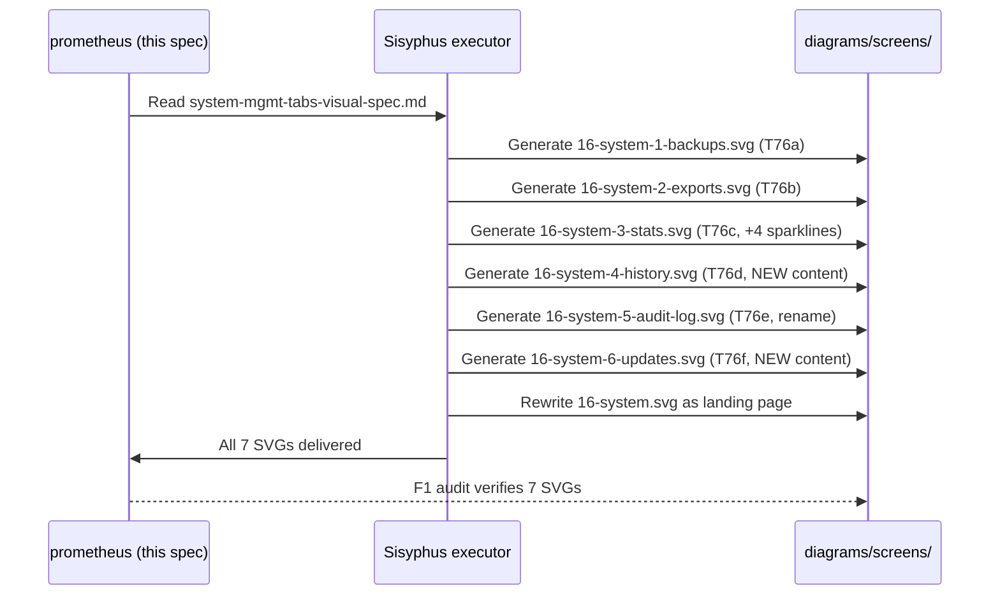

Per SVG:
1. Use the Mermaid `flowchart` above as structural blueprint
2. Replace Mermaid nodes with `<div style="position:absolute;left:Xpx;top:Ypx;width:Wpx;height:Hpx;...">` per lessons.md conventions
3. Sample data from existing `16-system.svg` lines 50-122 (Backups/Exports/Stats/Audit panels)
4. Generate new content for History (per §4 above) and Updates (per §6 above)
5. Verify all 7 SVGs follow inline-styles-only convention (`grep -r 'class="' diagrams/screens/16-system*.svg` returns 0)
6. All SVGs at viewBox `0 0 1280 800` and `width="100%" preserveAspectRatio="xMidYMid meet"`

---

## 10. Cross-reference table

| This spec | Plan task | Audit section |
|---|---|---|
| Tab 1 Backups | T76a | audit §19, §19.10 |
| Tab 2 Exports | T76b | audit §19, §19.10 |
| Tab 3 Stats | T76c | audit §19, §19.10 (sparklines NEW) |
| Tab 4 History | T76d (NEW content) | audit §19, §19.4 |
| Tab 5 Audit Log | T76e (rename) | audit §19, §19.10 |
| Tab 6 Updates | T76f (NEW content) | audit §19.4 |
| Landing page | T76 (rewrite) | audit §19.5 option C |
| Backup-create modal | T77 | audit §21 |
| Detail panels | T78-T82 | audit §23 |
| Plugin/theme mocks | T83-T84 | audit §23 |

---

## 11. Sign-off

This document is the **Mermaid-based visual spec** for the 6 System Management tabs.

User can preview this spec in any markdown viewer (GitHub, VS Code, Obsidian)
to verify visual coverage of all 6 tabs without waiting for SVG generation.

Date: 2026-07-07
Author: prometheus (planner)
Status: MERMAID VISUAL SPEC COMPLETE — executor converts to SVG per Wave 10 T76a-T76f.
