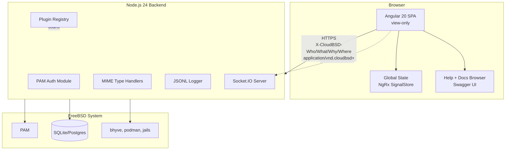

# CloudBSD Admin — System Architecture

High-level architecture diagram for the CloudBSD Admin Angular migration.

## Layers

```
┌─────────────────────────────────────────────────────────────┐
│                  Browser (Angular 20 SPA)                   │
│  - View-only UI (no write actions)                          │
│  - 47 locales via $localize                                  │
│  - 15 themes (light/dark/HC + 12 retro)                     │
│  - Plugin template renderer (renders manifest-driven UI)    │
│  - Global state store (NgRx SignalStore, Socket.IO hydrate)  │
│  - Help system, in-app docs browser, Swagger UI            │
└─────────────────────────────────────────────────────────────┘
                            │ HTTPS
                            │ X-CloudBSD-Who/What/Why/Where
                            │ application/vnd.cloudbsd+<action>
                            ▼
┌─────────────────────────────────────────────────────────────┐
│           Node.js 24 Backend (Express 5 + PAM)              │
│  - PAM authentication (security/openpam)                    │
│  - Plugin registry (scans plugins/ on boot)                 │
│  - Custom MIME type handlers                                │
│  - JSONL logger (modular, swappable)                        │
│  - Socket.IO server (streams updates to clients)            │
│  - Pre-flight + health endpoints                            │
│  - OpenAPI 3.1 spec served at /api/openapi.json             │
└─────────────────────────────────────────────────────────────┘
            │                    │                    │
            ▼                    ▼                    ▼
   ┌──────────────┐    ┌──────────────┐    ┌──────────────┐
   │   PAM        │    │  SQLite or   │    │  Service     │
   │  (system     │    │  Postgres    │    │  Discoverers │
   │   accounts)  │    │  (sessions,  │    │  (bhyve,     │
   │              │    │   themes,    │    │   podman,    │
   │              │    │   plugins)   │    │   jails)     │
   └──────────────┘    └──────────────┘    └──────────────┘
```

## Plugin Flow

```
┌─────────────────────────────────────────────────────────────┐
│  plugins/                                                    │
│    ├── bhyve-metrics/                                        │
│    │     ├── plugin.json (manifest)                          │
│    │     ├── templates/ (renderable by Angular)              │
│    │     ├── routes/ (Express handlers)                      │
│    │     └── discoverers/ (periodic data fetchers)           │
│    └── notification-aggregator/                              │
│          └── ...                                             │
└─────────────────────────────────────────────────────────────┘
              │ scanned at boot
              ▼
┌─────────────────────────────────────────────────────────────┐
│  Plugin Loader (backend)                                     │
│    - Validates manifest against JSON schema                  │
│    - Dynamically imports plugin entry module                 │
│    - Registers routes under /api/plugins/<name>/*            │
│    - Builds aggregated /api/plugins response                 │
└─────────────────────────────────────────────────────────────┘
              │ frontend fetches /api/plugins on boot
              ▼
┌─────────────────────────────────────────────────────────────┐
│  Plugin Template Renderer (frontend)                         │
│    - Receives manifest from /api/plugins                    │
│    - Maps ComponentSpec.type → Angular component class       │
│    - Renders pages, modals, wizards, menu items              │
│    - Data binding via fetch + SignalStore update             │
└─────────────────────────────────────────────────────────────┘
```

## Authentication Flow

```
┌──────────┐                  ┌──────────┐                  ┌──────────┐
│ Browser  │  POST /api/auth/ │ Backend  │  pam_authenticate│   PAM    │
│          │  login           │          │ ───────────────► │          │
│          │  {user, pass}    │          │                  │          │
│          │ ◄────────────────│          │ ◄─────────────── │          │
│          │  Set-Cookie:     │          │   success/fail   │          │
│          │  session=<jwt>   │          │                  │          │
│          │  HttpOnly,       │          │                  │          │
│          │  Secure,         │          │                  │          │
│          │  SameSite=Strict │          │                  │          │
└──────────┘                  └──────────┘                  └──────────┘
```

## Streaming State Flow

```
┌──────────────┐                  ┌──────────────┐                  ┌──────────────┐
│ Backend      │  Socket.IO       │ Frontend     │  SignalStore    │ UI           │
│ discoverers  │  emit event      │ Socket.IO    │  update signal  │ components   │
│              │ ───────────────► │ listener     │ ──────────────► │ re-render    │
│ (every 5s)   │                  │              │                  │              │
└──────────────┘                  └──────────────┘                  └──────────────┘

Example: VM list refresh
  discoverer.vm_list() → emit('vms:updated', [...]) →
  vmStore.update(vms) → <vm-list> re-renders
```

## Security Layers

```
Layer 1: TLS (nginx reverse proxy, Let's Encrypt)
Layer 2: CSP, HSTS, X-Frame-Options, X-Content-Type-Options
Layer 3: HttpOnly Secure SameSite=Strict session cookies
Layer 4: PAM authentication (no password storage in our app)
Layer 5: Authorization checks on every endpoint (admin vs user)
Layer 6: Rate limiting (express-rate-limit)
Layer 7: Input validation (zod schemas)
Layer 8: JSONL structured logs (auditable)
Layer 9: Frost-out modal on session expiry
Layer 10: View-only UI (no write actions exposed)
```

## FreeBSD Deployment

```
FreeBSD 14+
  └── port: www/cloudbsd-admin
        ├── rc.d script: /usr/local/etc/rc.d/cloudbsd-admin
        ├── binary: /usr/local/libexec/cloudbsd-admin/
        ├── config: /usr/local/etc/cloudbsd/admin/config.json
        ├── logs: /var/log/cloudbsd-admin/*.jsonl
        ├── themes: /usr/local/share/cloudbsd-admin/themes/
        ├── plugins: /usr/local/libexec/cloudbsd-admin/plugins/
        └── man pages: /usr/local/share/man/man{5,8}/
```

## Diagram



## Related

- Plan section: New Architecture
- File: `diagrams/architecture/01-system-architecture.md`
- See also: `diagrams/flows/` for interaction sequences