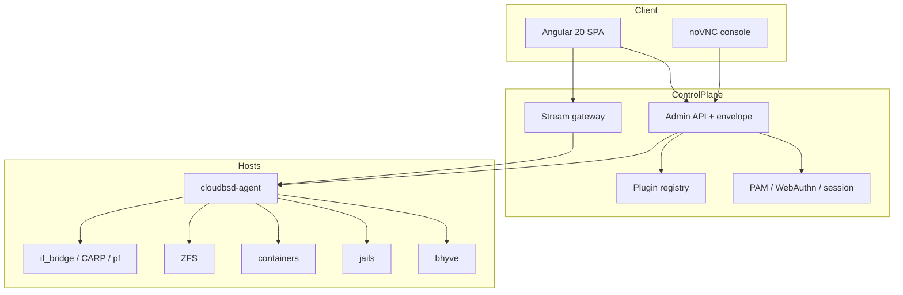
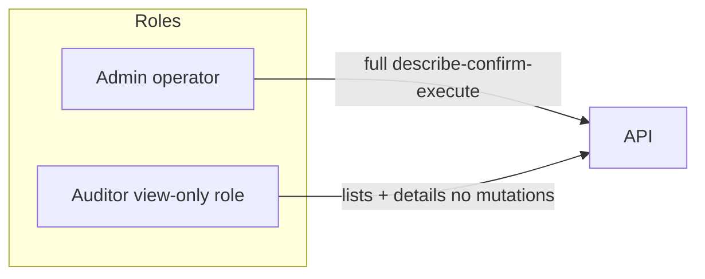

# System architecture (Mermaid)

> Target FreeBSD control plane. Implementation deferred; this is the planning picture.

```mermaid
flowchart TB
  subgraph Client
    SPA[Angular 20 SPA]
    VNC[noVNC console]
  end

  subgraph ControlPlane
    API[Admin API + envelope]
    Auth[PAM / WebAuthn / session]
    Stream[Stream gateway]
    Plug[Plugin registry]
  end

  subgraph Hosts
    Agent[cloudbsd-agent]
    Bhyve[bhyve]
    Jail[jails]
    OCI[containers]
    ZFS[ZFS]
    Net[if_bridge / CARP / pf]
  end

  SPA --> API
  SPA --> Stream
  VNC --> API
  API --> Auth
  API --> Plug
  API --> Agent
  Stream --> Agent
  Agent --> Bhyve
  Agent --> Jail
  Agent --> OCI
  Agent --> ZFS
  Agent --> Net
```

```mermaid
flowchart LR
  subgraph Roles
    Admin[Admin operator]
    RO[Auditor view-only role]
  end
  Admin -->|full describe-confirm-execute| API[API]
  RO -->|lists + details no mutations| API
```
