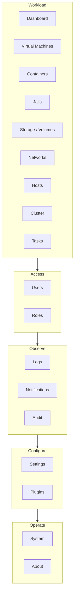
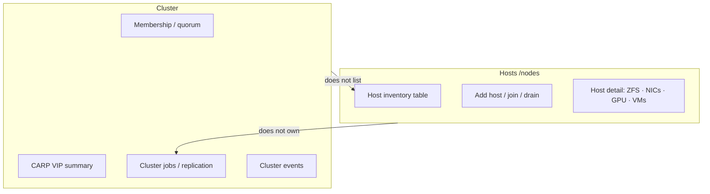
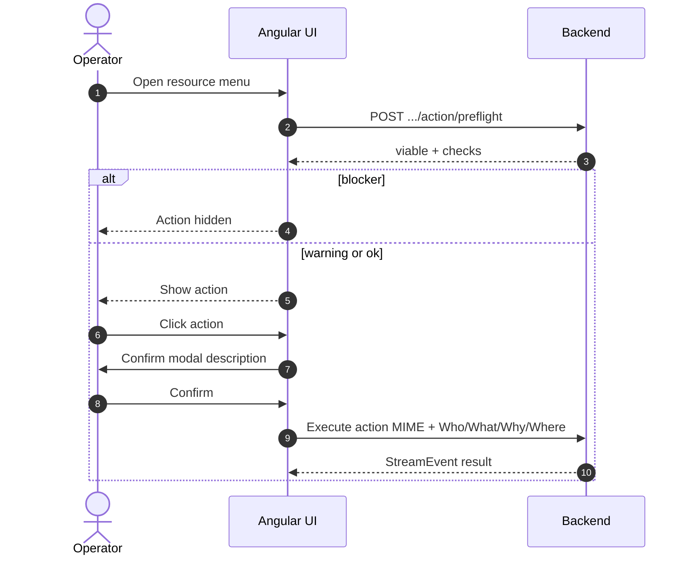
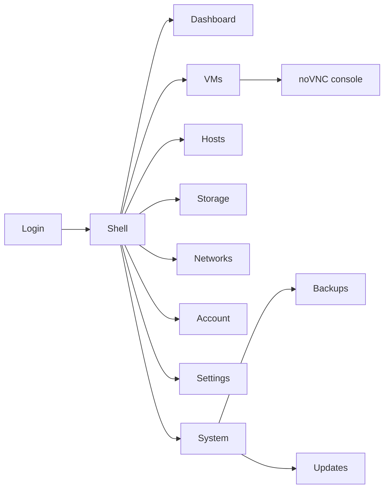

# Product information architecture (Mermaid)

> **Track 1 — conceptual diagrams** (Mermaid only).  
> UI mockups for the same IA are SVG Track 2 under `diagrams/screens/140-ia-*.svg`.  
> Canonical prose: `docs/migration/product-ia-esxi-vsphere-2026-07-16.md`  
> Agent index: `docs/migration/README.md`

## 1. Sidebar groups (target Angular shell)

## 2. Settings vs Account vs System

```mermaid
flowchart LR
  subgraph UserMenu["Avatar menu → My Account"]
    AP[Profile]
    AS[Security / 2FA]
    AA[Appearance]
    APR[Preferences]
    AT[Personal API tokens]
  end

  subgraph AdminSettings["Admin → Settings"]
    CI[Cluster identity]
    AUTH[Auth methods]
    HD[Host / agent defaults]
    NET[Networking defaults]
    ST[Storage defaults]
    INT[Integrations]
    LIC[Licensing]
  end

  subgraph SystemOps["Admin → System"]
    B[Backups policies + runs]
    UP[Updates]
    DIAG[Diagnostics]
    EX[Exports / support bundle]
    M[Maintenance]
  end

  UserMenu -.->|never mixes with| AdminSettings
  AdminSettings -.->|ops not prefs| SystemOps
```

## 3. Hosts vs Cluster

## 4. Action path (Rule #1 + #8)

## 5. Product spine (implement first)

## SVG companions (Track 2)

| File | Screen |
|------|--------|
| [`../screens/140-ia-shell-hosts.svg`](../screens/140-ia-shell-hosts.svg) | Shell + Hosts inventory (new sidebar) |
| [`../screens/141-ia-cluster-services.svg`](../screens/141-ia-cluster-services.svg) | Cluster services (not host table) |
| [`../screens/142-ia-account-security.svg`](../screens/142-ia-account-security.svg) | My Account · Security |
| [`../screens/143-ia-settings-cluster.svg`](../screens/143-ia-settings-cluster.svg) | Settings · Cluster identity |
| [`../screens/144-ia-system-backups.svg`](../screens/144-ia-system-backups.svg) | System · Backups |
