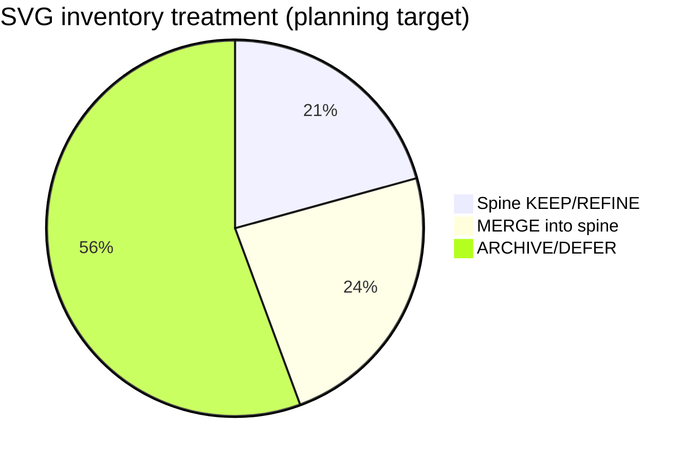
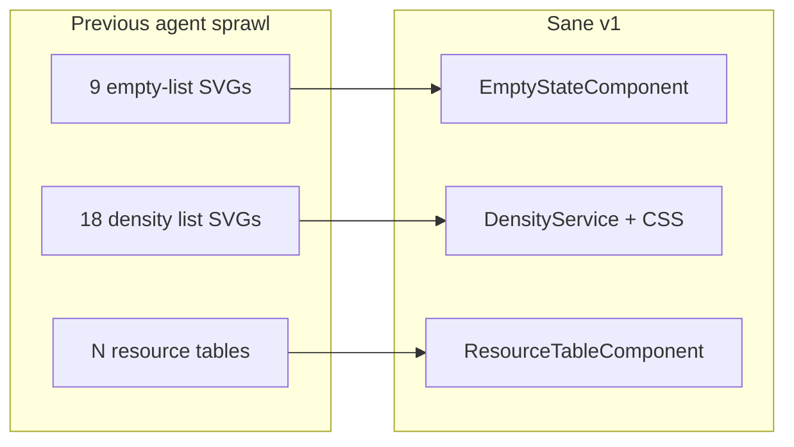
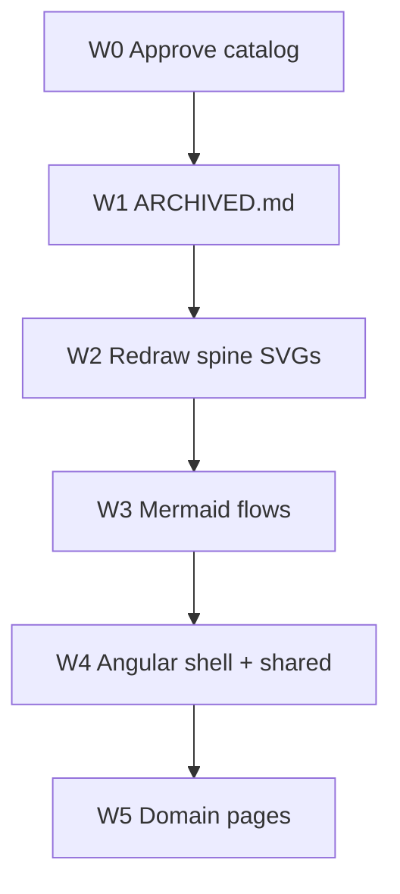

# Component catalog (Mermaid)

> Companion to `docs/migration/component-catalog-plan.md`.  
> **Planning only** — defines what is allowed before Angular implementation.

## Canonical vs archive volume

*Approximate counts from ~169 SVGs; exact triage tables live in the catalog plan.*

## Shared components replace SVG sprawl

## Implementation order after W0 approval

