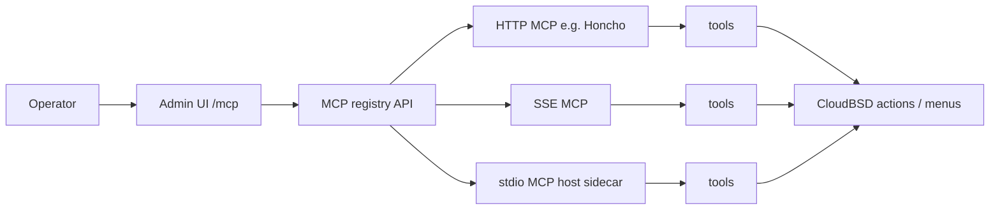
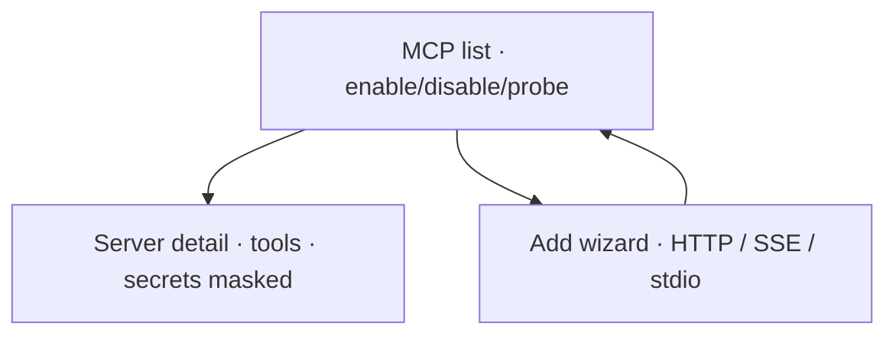

# MCP is the plugin system

> Product decision 2026-07-16: **no separate “Plugins” product.**  
> Operators register **MCP servers**; tools extend the control plane.

## Mental model

## Surfaces

## SVG mocks

| File | Purpose |
|------|---------|
| `../screens/160-mcp-registry.svg` | Registry list |
| `../screens/161-mcp-server-detail.svg` | Detail + tools |
| `../screens/162-mcp-add-wizard.svg` | Add server |

Legacy `17-plugins`, `81`, `131–133` → SUPERSEDED (see `../ARCHIVED.md`).
