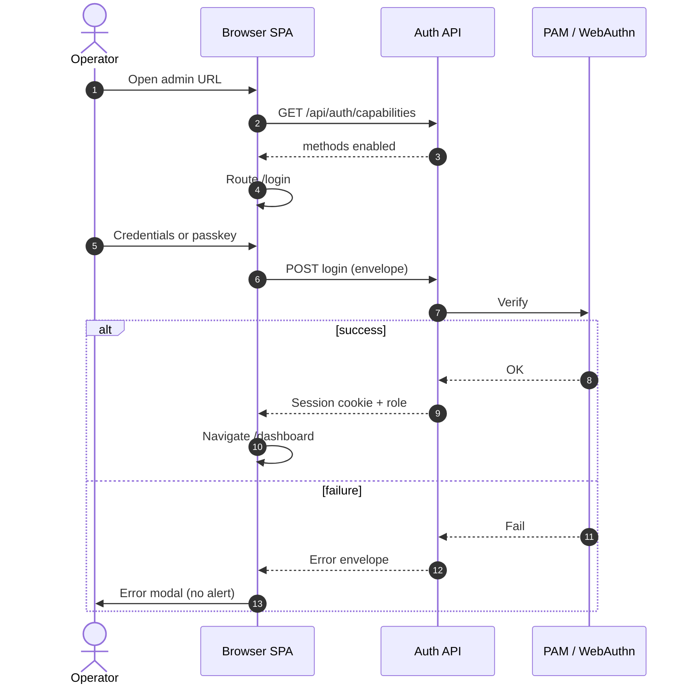

# Login flow

```mermaid
sequenceDiagram
  autonumber
  actor U as Operator
  participant B as Browser SPA
  participant A as Auth API
  participant P as PAM / WebAuthn

  U->>B: Open admin URL
  B->>A: GET /api/auth/capabilities
  A-->>B: methods enabled
  B->>B: Route /login
  U->>B: Credentials or passkey
  B->>A: POST login (envelope)
  A->>P: Verify
  alt success
    P-->>A: OK
    A-->>B: Session cookie + role
    B->>B: Navigate /dashboard
  else failure
    P-->>A: Fail
    A-->>B: Error envelope
    B->>U: Error modal (no alert)
  end
```
