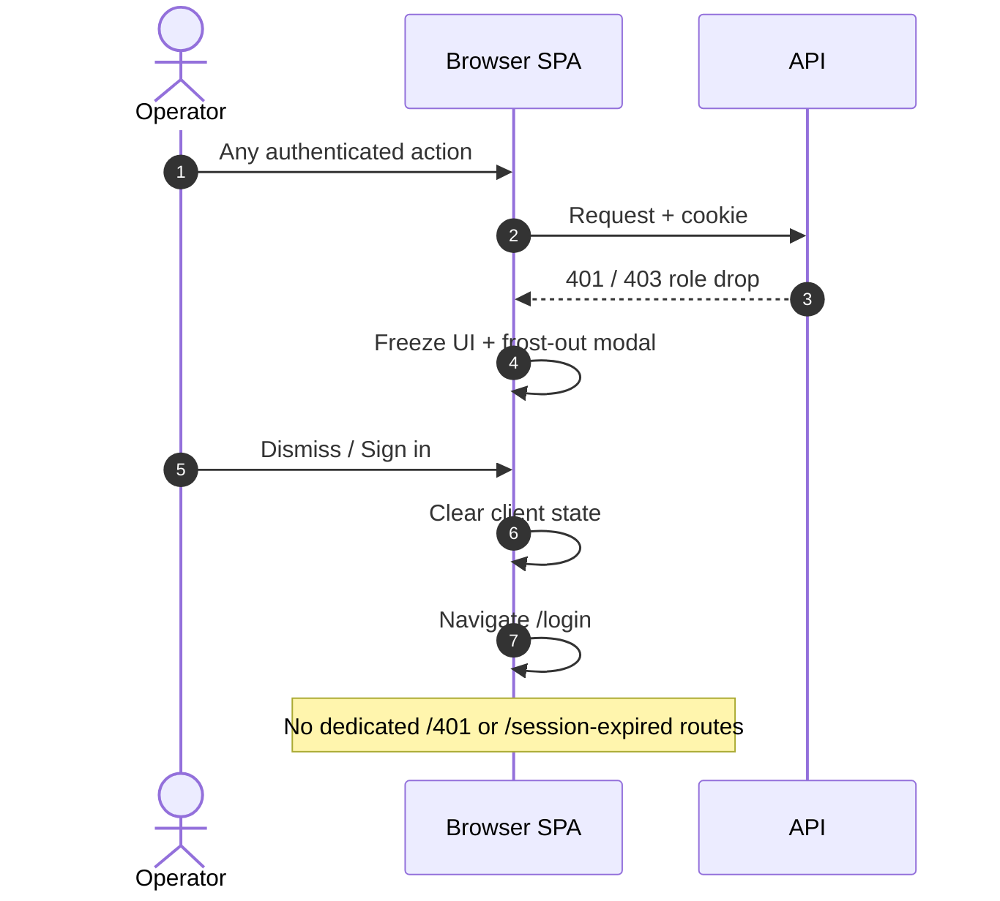

# Session expiry / frost-out flow

```mermaid
sequenceDiagram
  autonumber
  actor U as Operator
  participant B as Browser SPA
  participant A as API

  U->>B: Any authenticated action
  B->>A: Request + cookie
  A-->>B: 401 / 403 role drop
  B->>B: Freeze UI + frost-out modal
  U->>B: Dismiss / Sign in
  B->>B: Clear client state
  B->>B: Navigate /login
  Note over B: No dedicated /401 or /session-expired routes
```
