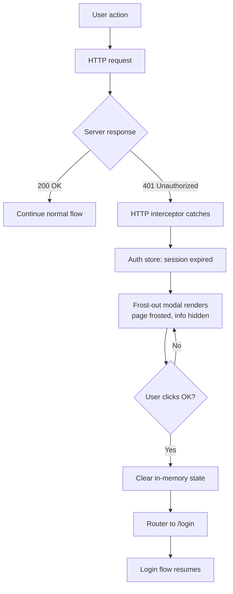

# Session Expiry Flow

Handles mid-session token expiry by surfacing a non-dismissable modal before forcing re-authentication.

## Trigger

- Any user action (HTTP request, navigation, button click)
- Server returns 401 Unauthorized
- Session TTL elapses on the backend

## Steps

1. User triggers an action while session is invalid
2. HTTP interceptor catches 401 response
3. Auth store marks session as expired
4. Frost-out modal renders over current view (page content frosted/blurred, info hidden)
5. User reads session-ended message
6. User clicks "OK"
7. Frontend clears all in-memory state (sensitive data)
8. Router navigates to `/login`
9. Pre-flight check runs again on login page mount

## Error Cases

- **Multiple concurrent 401s**: Debounce to show modal only once
- **Modal dismissed by ESC**: Re-block, force OK click
- **Network down during re-auth**: Stay on `/login`, show offline indicator
- **Refresh-token attempt fails**: Skip straight to full re-auth

## Diagram

## Related

- Plan section: Session Management
- Code module: `web-new/src/app/core/auth/session.interceptor.ts`
- Component: `SessionExpiredModalComponent` (frost-out modal)
- Diagram: `diagrams/errors/10-session-expired.svg`