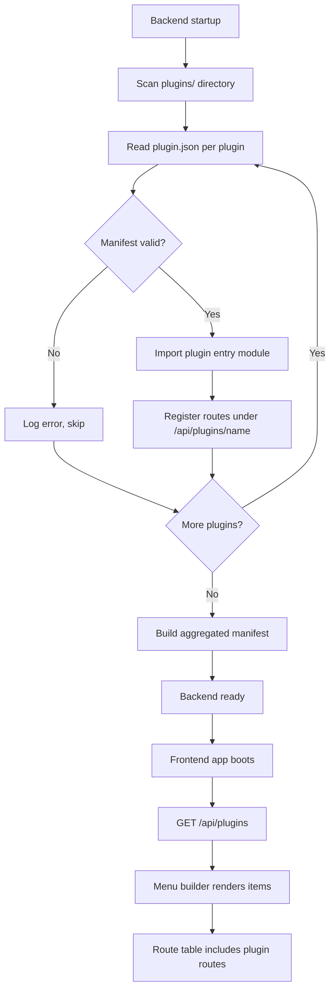

# Plugin Discovery Flow

Backend scans the plugins directory on startup, loads manifests, and registers routes. Frontend renders menu items based on discovered capabilities.

## Trigger

- Backend process boot
- Hot-reload during development
- Manual `POST /api/plugins/reload` admin action

## Steps

1. Backend boots, initializes plugin loader
2. Scans `plugins/` directory recursively
3. Reads each `plugin.json` manifest
4. Validates manifest schema (name, version, entry, capabilities)
5. Dynamically imports plugin entry module
6. Registers plugin routes under `/api/plugins/{name}/*`
7. Builds aggregated plugin manifest response
8. Frontend `/api/plugins` query on app boot
9. Menu builder renders items from manifest
10. Route table dynamically includes plugin routes

## Error Cases

- **Invalid manifest JSON**: Skip plugin, log error, continue scan
- **Schema validation failure**: Quarantine plugin, report in `/api/plugins/health`
- **Entry module throws on load**: Disable plugin, surface in admin diagnostics
- **Duplicate plugin name**: First wins, others logged as conflicts
- **Frontend fetch fails**: Render shell with plugins disabled banner

## Diagram

## Related

- Plan section: Plugin Architecture
- Code module: `web-new/src/app/core/plugins/plugin-loader.service.ts`
- Backend: `backend-new/src/plugins/plugin-loader.service.ts`
- Diagram: `diagrams/plugin/01-plugin-page.svg`