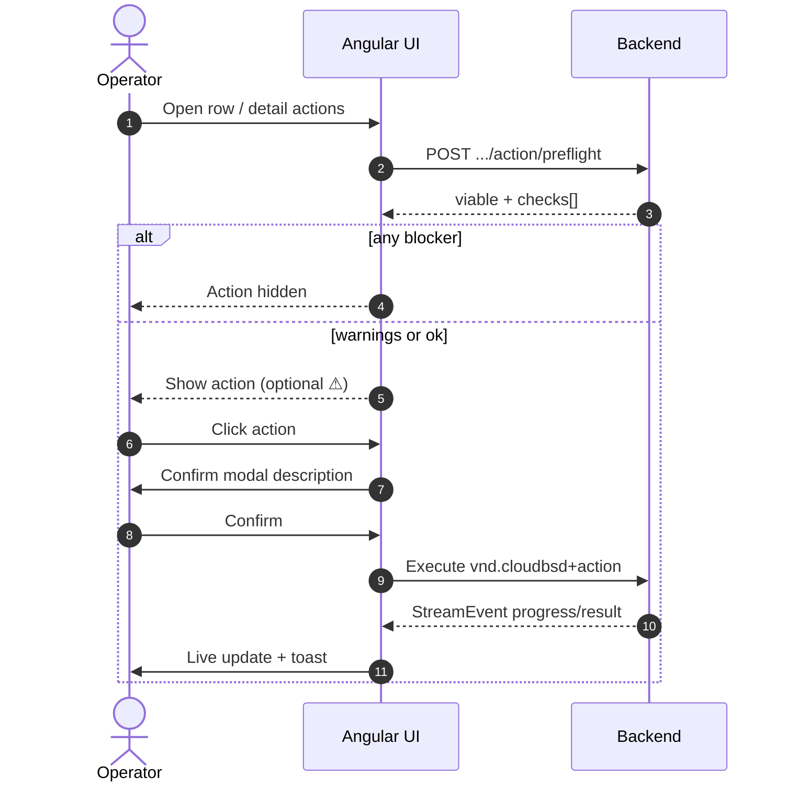

# Preflight → confirm → execute (Rule #1 + #8)

```mermaid
sequenceDiagram
  autonumber
  actor U as Operator
  participant UI as Angular UI
  participant API as Backend

  U->>UI: Open row / detail actions
  UI->>API: POST .../action/preflight
  API-->>UI: viable + checks[]
  alt any blocker
    UI-->>U: Action hidden
  else warnings or ok
    UI-->>U: Show action (optional ⚠)
    U->>UI: Click action
    UI->>U: Confirm modal description
    U->>UI: Confirm
    UI->>API: Execute vnd.cloudbsd+action
    API-->>UI: StreamEvent progress/result
    UI->>U: Live update + toast
  end
```
