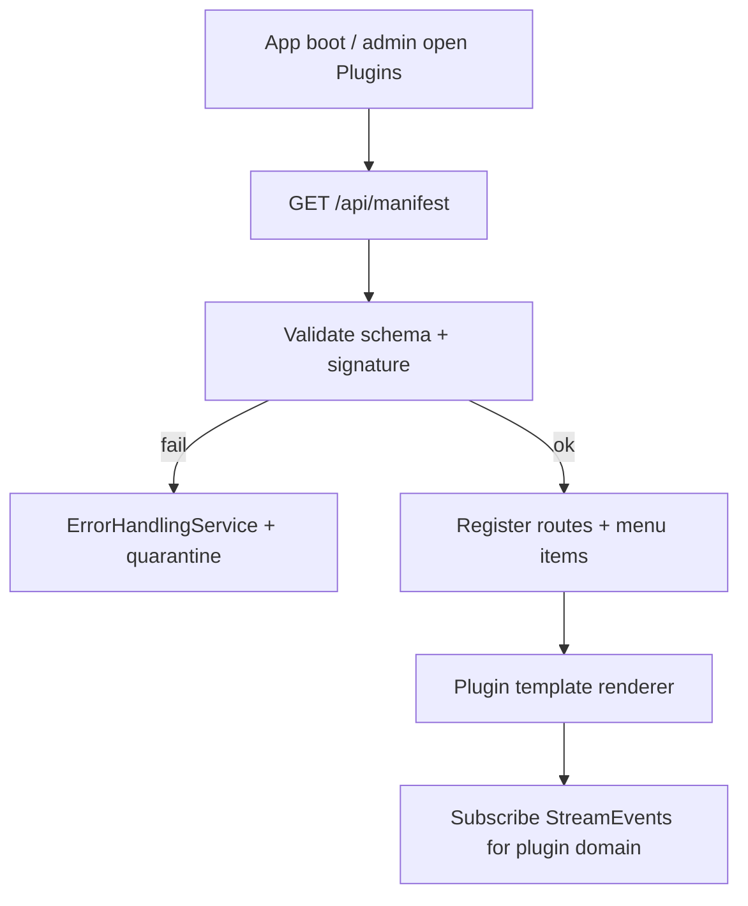

# Plugin discovery flow

```mermaid
flowchart TD
  Boot[App boot / admin open Plugins] --> Fetch[GET /api/manifest]
  Fetch --> Validate[Validate schema + signature]
  Validate -->|fail| Reject[ErrorHandlingService + quarantine]
  Validate -->|ok| Register[Register routes + menu items]
  Register --> Render[Plugin template renderer]
  Render --> Live[Subscribe StreamEvents for plugin domain]
```
