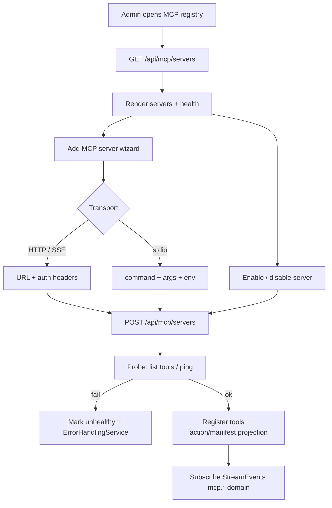

# MCP server registration / discovery flow

> **2026-07-16**: MCP **is** the plugin system. Legacy “plugin package” discovery is SUPERSEDED.  
> UI: Configure → **MCP** (`/mcp`). Mocks: `screens/160-mcp-*.svg`.

## Notes

- Secrets (headers, env) are stored server-side; UI never echoes full secret values after save.
- Tools may project into menus/actions via backend envelope/manifest — operator mental model remains **MCP registry**, not a separate Plugins product.
- Legacy flow names (`plugin`, `/api/plugins`) in older plan tasks map here.
