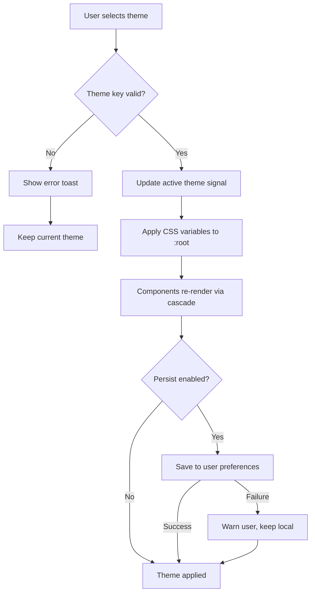

# Theme Application Flow

User-initiated theme change validated against an allow-list, applied via CSS custom properties, and persisted to user preferences.

## Trigger

- User opens theme picker in settings panel
- System preference change (prefers-color-scheme) on first load
- Persisted preference loaded on subsequent boots

## Steps

1. User selects theme from picker (one of 15 built-in or custom)
2. Frontend validates theme key against registered themes list
3. If valid, theme service updates the active theme signal
4. CSS custom properties applied to `:root` via inline style update
5. All themed components re-render via CSS variable cascade
6. Preference persisted to user settings (backend or local storage)
7. Theme survives reload via preference hydration on app boot

## Error Cases

- **Unknown theme key**: Reject selection, show error toast, keep current theme
- **Backend persist fails**: Apply locally, queue retry, warn user
- **Corrupted stored preference**: Fall back to system theme, reset storage
- **CSS variable write fails** (extremely rare): Force full page reload

## Diagram

## Related

- Plan section: Theming & Design Tokens
- Code module: `web-new/src/app/core/theme/theme.service.ts`
- Tokens: `web-new/src/styles/_tokens.scss`
- Diagram: `diagrams/themes/01-cloudbsd-revytech.svg` (default theme)