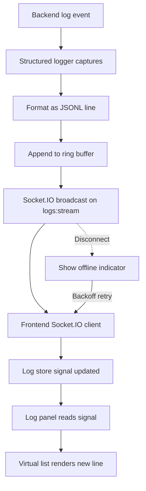

# Log Streaming Flow

Backend emits structured log lines written as JSONL, broadcast over Socket.IO, consumed by frontend store, and rendered live in the UI.

## Trigger

- Backend emits a log event (info, warn, error, debug)
- Admin opens the live logs panel
- Auto-reconnect after Socket.IO disconnect

## Steps

1. Backend logger captures event with timestamp, level, source, message
2. JSONL writer formats the line and appends to in-memory ring buffer
3. Socket.IO broadcasts to subscribed clients on `logs:stream` channel
4. Frontend Socket.IO client receives event
5. Log store updates signal with new entries (capped at N items)
6. Log panel component reads signal, appends to virtual list
7. UI renders new line without scroll jump unless user is at bottom

## Error Cases

- **Socket.IO disconnect**: Show offline indicator, auto-reconnect with backoff
- **Buffer overflow**: Drop oldest entries, emit overflow warning event
- **Malformed JSONL line**: Log parse warning, drop line, continue
- **Frontend store memory cap hit**: Evict oldest, persist snapshot to IndexedDB
- **Subscription denied**: Surface permission error, suggest admin role check

## Diagram

## Related

- Plan section: Observability & Logging
- Code module: `web-new/src/app/core/logging/log-stream.service.ts`
- Backend: `backend-new/src/logging/log-broadcaster.service.ts`, Socket.IO server
- Diagram: `diagrams/screens/09-logs.svg`