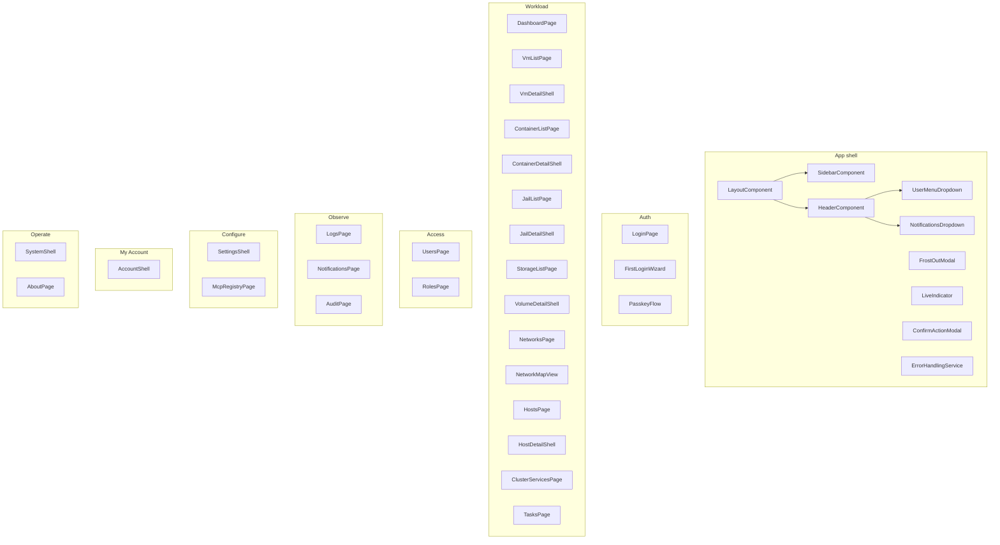
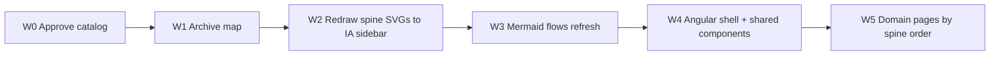

# CloudBSD Admin — Component & Screen Catalog Plan

> **Status**: PLANNING ONLY — no implementation until this catalog is approved  
> **Date**: 2026-07-16  
> **Branch**: `feat/angular-migration`  
> **Authority**: Product IA → this catalog → SVG mockups → Angular code  
> **Related**:  
> - [product-ia-esxi-vsphere-2026-07-16.md](./product-ia-esxi-vsphere-2026-07-16.md)  
> - [README.md](./README.md) (agent index)  
> - [diagrams/architecture/02-product-ia.md](../../diagrams/architecture/02-product-ia.md)  
> - `.sisyphus/drafts/ui-index.md`  
> - SVG reference set: `diagrams/screens/140-ia-*.svg` … `144-ia-*.svg`

---

## 1. Problem statement

Prior agents produced a large volume of planning artifacts (**~169 SVGs** in `diagrams/` alone: 96 screens, 54 components, 18 modals, plus empty theme/customizer/error dirs promised in the plan). Much of that inventory:

- **Duplicates** the same concept (login 12 vs 51; about 13 vs 85; cluster 07 vs 67; nodes 15 vs hosts IA)
- **Optimizes polish** (15 themes, 8 customizer panels, cozy/compact/extra × resource empty states) before the hypervisor spine exists
- **Contradicts product IA** (permanent view-only, dual Settings models, Cluster as host table, Status as separate chrome)
- **Bloats the plan** so implementers cannot see a sane component tree

This document defines **what components actually exist in the product**, what mockups are canonical, and what is archived or never built.

---

## 2. Design rules for the catalog

| Rule | Meaning |
|------|---------|
| **Spine first** | Only product-spine surfaces are implementation-mandatory for v1 |
| **One home per concept** | No dual Settings, dual login, dual about, dual cluster |
| **One density system** | Density is a CSS/setting, not N×M SVG files |
| **One empty state pattern** | Shared `EmptyStateComponent`, not 9 empty-list SVGs |
| **Detail = tabs + content** | One detail shell per resource; tab content is optional mock, not separate routes |
| **Mermaid vs SVG** | Architecture/catalog structure = Mermaid; UI appearance = SVG foreignObject |
| **Kill vanity** | Theme pack browser, file manager, locale/theme stat tiles do not block ESXi parity |

---

## 3. Target Angular module map (sane product tree)

### Shared building blocks (implement once)

| Component | Purpose | Replaces |
|-----------|---------|----------|
| `ResourceTableComponent` | Status, name, filters, sort, pagination, bulk select | Per-resource table forks |
| `DensityDirective` / CSS vars | cozy / compact / extra | 24 compact + extra-compact SVGs |
| `EmptyStateComponent` | No data / no filter match | 9 empty-list SVGs |
| `StatCardsRowComponent` | 3–5 KPI tiles | Duplicated cards on every list |
| `FilterBarComponent` | Search + status chips | Duplicated toolbars |
| `DetailShellComponent` | Title + tabs + actions + outlet | Per-resource chrome |
| `ConfirmActionModal` | Describe + preflight warnings + type-to-confirm | Ad-hoc modals |
| `WizardShellComponent` | Stepper + back/next/review | Per-wizard chrome SVGs |
| `LiveIndicatorComponent` | ● live · Xs ago | Repeated header text |
| `CapabilityActionMenu` | Actions after preflight | Always-on action buttons |

---

## 4. Screen catalog triage

Legend: **KEEP** = implement + maintain mock · **REFINE** = keep concept, redraw to IA · **MERGE** = fold into another · **DEFER** = post-spine · **ARCHIVE** = do not implement / move to `diagrams/archived/` later

### 4.1 Product spine (KEEP / REFINE)

| ID | Current file(s) | Target product surface | Disposition |
|----|-----------------|------------------------|-------------|
| S01 | `01-dashboard.svg` | Dashboard | **REFINE** — capacity + alerts; drop decorative-only widgets if needed |
| S02 | `02-vms.svg` | VMs list | **REFINE** — management actions + live pill; IA sidebar |
| S03 | `03-containers.svg` | Containers list | **REFINE** |
| S04 | `04-jails.svg` | Jails list | **REFINE** |
| S05 | `05-volumes.svg` | Storage list | **REFINE** — rename nav label Storage |
| S06 | `06-network-map.svg` + `69-network-ip-pools.svg` | Networks (list + map view) | **MERGE** — one Networks page, map is view mode |
| S07 | `15-nodes.svg` / `140-ia-shell-hosts.svg` | Hosts | **KEEP** `140` as canonical; **ARCHIVE** competing host chrome on `15` after port |
| S08 | `07-cluster.svg` / `67-cluster-overview.svg` / `141-ia-cluster-services.svg` | Cluster services | **KEEP** `141`; **ARCHIVE** host-table Cluster mocks |
| S09 | — | Tasks | **KEEP** (new screen; no good SVG yet — plan mock) |
| S10 | `08-users.svg` | Users (control-plane) | **REFINE** — filter out OS service accounts by default |
| S11 | — | Roles | **KEEP** (new; may be Users tab v1) |
| S12 | `09-logs.svg` / `87-log-streaming.svg` | Logs | **MERGE** into one Logs page with time-range + buffer |
| S13 | `10-notifications.svg` | Notifications inbox | **REFINE** |
| S14 | `16-system-5-audit-log.svg` | Audit | **KEEP** under Observe (not buried only in System) |
| S15 | `143-ia-settings-cluster.svg` + settings set | Settings shell | **KEEP** `143` pattern; **ARCHIVE** dual model `11-settings` |
| S16 | `142-ia-account-security.svg` | My Account | **KEEP** `142` pattern |
| S17 | `144-ia-system-backups.svg` + system tabs | System shell | **KEEP** `144`; retab System (see §5) |
| S18 | `160-mcp-registry.svg` / `161-mcp-server-detail.svg` / `162-mcp-add-wizard.svg` | **MCP** (was Plugins) | **KEEP** — MCP **is** the plugin system; legacy `17`/`81`/`131–133` SUPERSEDED |
| S19 | `13-about.svg` / `85-about-page.svg` | About | **MERGE** → one About |
| S20 | `12-login.svg` / `51-login.svg` | Login | **MERGE** → one Login (prefer richer auth) |
| S21 | `78-vm-console-vnc.svg` | VM console | **KEEP** (noVNC) |
| S22 | `92-auth-capabilities-admin.svg` + `93-preflight-diagnostics-admin.svg` | System → Diagnostics | **MERGE** into Diagnostics tabs |
| S23 | Onboarding / first-login wizards | Day-1 | **KEEP** one path (see §4.3) |

### 4.2 System shell tabs (sane)

| Tab | Disposition | Notes |
|-----|-------------|-------|
| Backups | **KEEP** | Policies + runs (merge `83-settings-backup-config` into this) |
| Updates | **KEEP** | Agent / MCP servers / FreeBSD (`16-system-6`, `76`, `77`) |
| Diagnostics | **KEEP** | Absorb `14-status`, `92`, `93` |
| Exports | **REFINE** | Support bundle; drop theme-library vanity as primary |
| Audit | **MOVE** | Prefer Observe → Audit; System may deep-link |
| History | **MERGE** | Ops event timeline → Tasks or Audit filters |
| Stats | **ARCHIVE** for v1 | Locales/themes KPI tiles are not ops value |
| Maintenance | **KEEP** (new if missing) | Drain-all, maintenance mode |

### 4.3 Auth / onboarding (MERGE duplicates)

| Files | Disposition |
|-------|-------------|
| `12-login`, `51-login` | **MERGE** → one login mock + implement once |
| `52-two-factor-setup`, `05-passkey-login`, `28-recovery-codes` | **KEEP** as modal/flow components |
| `53-password-reset`, `54-account-locked` | **KEEP** (thin) |
| `56–58` onboarding + `121–124` wizard | **MERGE** → one onboarding wizard (4 steps) |
| `128–130`, `134` first-login | **KEEP** one first-login wizard |
| `57` cluster join | **KEEP** (also join-token modals) |

### 4.4 Create wizards (KEEP spine, drop noise)

| Wizard | Disposition |
|--------|-------------|
| VM 102–106 | **KEEP** |
| Container 107–110 | **KEEP** |
| Jail 111–114 | **KEEP** |
| Volume 115–117 | **KEEP** |
| Network 118–120 | **KEEP** (Networks product) |
| Restore 125–127 | **KEEP** (ties to Backups) |
| Plugin install 131–133 | **SUPERSEDED** by `162-mcp-add-wizard` |
| Theme import 21-modal | **DEFER** |

### 4.5 Low-value / ARCHIVE or DEFER

| Files | Disposition | Why |
|-------|-------------|-----|
| `66-themes-browser`, theme pack About card sprawl | **DEFER** | One light/dark/HC for v1 |
| Entire `diagrams/themes/` + `customizer/` (plan claimed 15+8; dirs empty) | **DO NOT REGENERATE** | Polish wave later |
| Compact/extra-compact list SVGs `24–41` | **ARCHIVE** | Density = CSS, one list component |
| Empty-list SVGs `42–50` | **ARCHIVE** | One `EmptyStateComponent` |
| `68-monitoring-dashboard` | **MERGE/DEFER** | Dashboard is enough for v1 |
| `79-file-manager` | **ARCHIVE** | Risk, not spine |
| `14-status` as top-level nav | **MERGE** → Diagnostics |
| `80-notifications-preferences` | **MERGE** → Account · Preferences or Notifications page section |
| `82-help-docs-page` | **DEFER** | Link out / minimal |
| `11-settings` read-only banner model | **ARCHIVE** | Conflicts with management IA |
| `60–65`, `83–84` Settings family | **REFINE selectively** into Account vs Settings map (see §5); do not ship both trees |
| `16-system-3-stats` | **ARCHIVE** vanity metrics | |
| Error screens in `screens/72–75` | **KEEP** thin set (403/404/500/503) under shell | |
| Plan T64 regenerate 78 theme/error/customizer SVGs | **CANCEL** unless spine complete | |

### 4.6 Settings / Account file mapping

| Product section | Prefer source mock | Disposition of others |
|-----------------|--------------------|------------------------|
| Account · Profile/Security/Appearance/Prefs/Tokens | `142-ia-*`, parts of `61–64` | Drop from Admin Settings |
| Settings · Cluster identity | `143-ia-*`, `60` general (identity fields only) | — |
| Settings · Auth methods | New refine from `92` capabilities | Not personal 2FA |
| Settings · Host defaults / NTP | `26-ntp` modal + part of `84` | NTP once only |
| Settings · Networking defaults | `84` VIP/DNS subset | Host NICs stay on Host detail |
| Settings · Integrations / webhooks | `65`, `25-webhook-create` | — |
| Settings · Licensing | React Settings license cards | — |
| System · Backups | `144-ia-*`, `16-system-1`, `27-backup-schedule`, `19-backup-create`, `70-backup-detail` | **ARCHIVE** Settings-only backup page as sole home |
| System · Updates | `16-system-6`, `76`, `77` | — |

---

## 5. Component mock triage (`diagrams/components/`)

### 5.1 KEEP (spine)

| File | Product component |
|------|-------------------|
| `18-add-node-dialog.svg` | AddHostDialog (3 tabs) |
| `19-vm-detail-panel.svg` + `90/91/110/111` | VmDetailShell + tabs |
| `20-container-detail-panel.svg` + `92/93` | ContainerDetailShell |
| `21-jail-detail-panel.svg` + `94/95` | JailDetailShell |
| `22-volume-detail-panel.svg` + `96/97` | VolumeDetailShell |
| `23-node-detail-panel.svg` + `98–103` | HostDetailShell |
| `16-ips-modal.svg` / modals `32–34` | Network edit flows (with preflight) |
| `17-vgpu-pool.svg` (+ list) | GpuPoolPanel (feature-flag) |
| `88-user-menu-dropdown.svg` | UserMenu → Account routes |
| `89-notifications-menu-dropdown.svg` | Header notifications |

### 5.2 ARCHIVE (no separate implementation artifacts)

| Files | Replace with |
|-------|----------------|
| `24–32` compact lists | `ResourceTable` + density CSS |
| `33–41` extra-compact lists | same |
| `42–50` empty lists | `EmptyStateComponent` |

---

## 6. Modal triage

| Modal | Disposition |
|-------|-------------|
| Confirm (generic) | **KEEP** — primary pattern for all mutations |
| `04-wizard-modal` | **KEEP** as WizardShell chrome |
| `05-passkey-login`, `28-recovery-codes` | **KEEP** |
| `19-backup-create`, `27-backup-schedule` | **KEEP** |
| `20-plugin-install`, `22-plugin-detail` | **SUPERSEDED** → MCP add/detail |
| `23-user-create`, `24-api-key-create` | **KEEP** (Access) |
| `25-webhook-create` | **KEEP** (Settings · Integrations) |
| `26-ntp-server-add` | **KEEP** (Settings · Host defaults) |
| `29–30` join token | **KEEP** |
| `31-manual-snapshot` | **KEEP** (VM/Volume detail) |
| `32–34` edit interfaces/LACP/IPs | **KEEP** with Rule #8 preflight |
| `21-theme-import` | **DEFER** |

---

## 7. Implementation component checklist (Angular)

Use this as the **only** allowed component inventory for v1 coding waves. Anything not listed needs an IA exception.

### 7.1 Shell

- [ ] `LayoutComponent`
- [ ] `SidebarComponent` (IA groups from product IA §3)
- [ ] `HeaderComponent`
- [ ] `UserMenuDropdownComponent`
- [ ] `NotificationsDropdownComponent`
- [ ] `LiveIndicatorComponent`
- [ ] `FrostOutModalComponent`
- [ ] `ConfirmActionModalComponent`
- [ ] `ErrorHandlingService` + toast/banner

### 7.2 Shared resource UI

- [ ] `ResourceTableComponent` (+ sort, pagination, bulk select per scale review)
- [ ] `FilterBarComponent`
- [ ] `StatCardsRowComponent`
- [ ] `EmptyStateComponent`
- [ ] `DetailShellComponent`
- [ ] `WizardShellComponent`
- [ ] `CapabilityActionMenuComponent`
- [ ] `DensityService` (cozy/compact/extra)

### 7.3 Domain pages (spine)

- [ ] Dashboard, VMs, Containers, Jails, Storage, Networks (+ map view), Hosts, Cluster, Tasks  
- [ ] Detail shells: VM, Container, Jail, Volume, Host  
- [ ] Console (noVNC)  
- [ ] Users, Roles (or Users tabs)  
- [ ] Logs, Notifications, Audit  
- [ ] Account shell (profile/security/appearance/prefs/tokens)  
- [ ] Settings shell (cluster/auth/host/net/storage/integrations/licensing)  
- [ ] System shell (backups/updates/diagnostics/exports/maintenance)  
- [ ] **MCP** registry list + server detail + add wizard (HTTP/SSE/stdio)  
- [ ] MCP probe/health + tools inventory  
- [ ] *(Legacy “Plugins” label removed — MCP is the extension model)*
- [ ] About  
- [ ] Login + first-login + onboarding (single path each)

### 7.4 Explicitly out of v1 scope

- Theme customizer suite / 15 theme showcase  
- File manager  
- Monitoring dashboard distinct from Dashboard  
- Full OS user directory as default Users view  
- MIME registry completeness as a gate  
- Regenerating empty `themes/`, `customizer/`, `errors/` directories wholesale  

---

## 8. Planning waves (docs/mocks only — then implement)

| Wave | Work | Exit criteria | Status |
|------|------|----------------|--------|
| **W0** | Component catalog | Catalog committed | **DONE** 2026-07-16 |
| **W1** | `diagrams/ARCHIVED.md` | List committed | **DONE** |
| **W2** | Spine SVGs `150-spine-*` + IA `140-ia-*` | Chrome matches product IA | **DONE** |
| **W3** | Mermaid flows + architecture | Under `diagrams/flows`, `architecture` | **DONE** |
| **W4** | **Implementation**: shell + shared components | App shell navigable | **PENDING** |
| **W5+** | Domain pages per §7.3 | Per-page DoD | **PENDING** |

**Planning complete.** See [PLANNING-COMPLETE.md](./PLANNING-COMPLETE.md). Angular feature work starts at **W4**.

---

## 9. Mockup quality bar (when redrawing)

1. Sidebar matches product IA §3 (groups Workload…Operate)  
2. No permanent “View-only” product banner  
3. Live indicator on changing data  
4. Actions only after preflight pattern (or confirm modal)  
5. Inline styles only in SVG foreignObject  
6. Sample hosts use `prod-node-*` / `example.lan` (Rule #7)  
7. One mock per product surface — link variants in ADJUSTMENTS, don’t fork IDs  

---

## 10. Success metrics for “sane”

| Metric | Today | Target after catalog |
|--------|------:|----------------------|
| Screen SVGs treated as canonical for v1 | ~96 | **≤ 35** spine + auth + wizards |
| Density/empty SVGs as separate products | 27 | **0** (pattern components) |
| Settings models | 2 | **1** admin Settings + **1** Account |
| Host inventory homes | 2+ | **1** (Hosts) |
| Theme/customizer mock debt | Plan 23 files | **0** until post-spine |
| Angular components for v1 | unbounded | **§7 checklist only** |

---

## 11. Open decisions (need user input only if disagreeing)

Defaults assumed; object to flip:

1. **Roles** ship as Users sub-tabs in v1 (not full Roles page).  
2. **Audit** lives under Observe (System deep-links).  
3. **Network Map** is a view toggle on Networks, not a top-level sibling forever.  
4. **Content library (ISO/templates)** is a spine gap — add one list page in W2 mocks before VM wizard polish.  
5. **Tasks** page is mandatory spine (even if thin: table of jobs).  

---

## 12. Author

Mark LaPointe \<mark@cloudbsd.org\>  
Planning artifact for Angular migration — not executable code.
